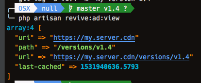
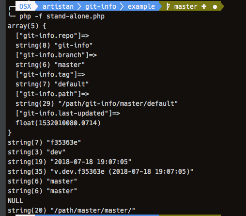

### example cdn data

note the url is build dynamically from the cdn.uri and the git-info.path

```php
        dd(config('cdn'));
```

#### this is after tagging the repository 

Likely used in ...
- production
- milestone

Tag name used ...
- versioned on the deployed branch



#### this is without a tag on the repository

Likely used in ...
- stagging
- development

No tag ends up being `default'
- separate urls for branches

 

### copy the files in this example 

This will help you get the basic configuration of setting up dynamic urls and customizing it for your repository and how you use it.
