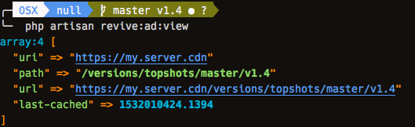

### example cdn data

note the url is build dynamically from the cdn.uri and the git-info.path

```php
        dd(config('cdn'));
```

#### this is after tagging the repository 

- production
- milestone
- versioned on the same branch



#### this is without a tag on the repository

- stagging
- development
- separate branches for deployments


### copy the files in this example 

This will help you get the basic configuration of setting up dynamic urls and customizing it for your repository and how you use it.
